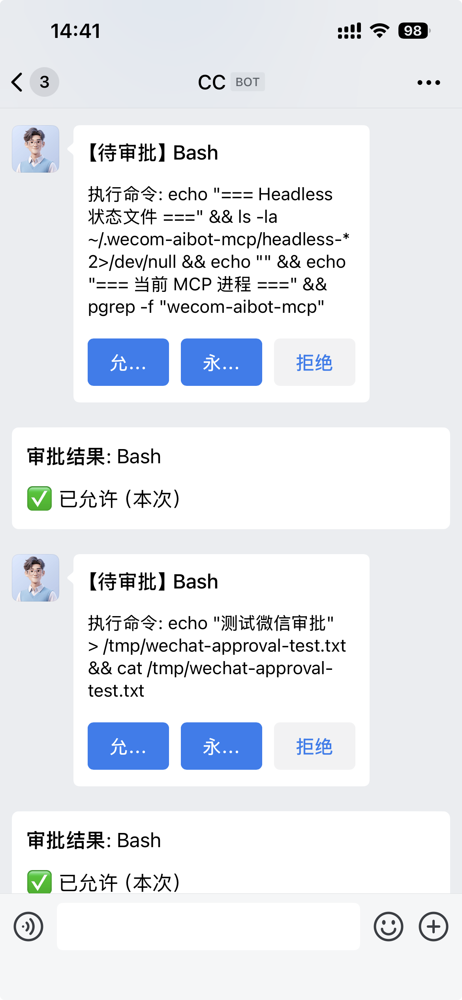

# @vrs-soft/wecom-aibot-mcp

中文 | [English](README_EN.md)

企业微信智能机器人 MCP 服务 - 让 Claude Code 通过微信远程审批和交互。

**核心功能**：
- 远程审批敏感操作（Bash/Write/Edit），微信卡片一键通过/拒绝
- 离开电脑后通过微信下达任务，实时接收进度通知
- 支持群聊 @机器人，多机器人、多用户并发
- 代理企业微信文档 MCP，支持文档和智能表格操作

---

## 效果预览



每次 Claude 执行敏感操作（Bash 命令、编辑文件等）时，企业微信会推送审批卡片，点击**允许**或**拒绝**即可实时控制执行权限。超时未响应时，根据配置自动代批（允许项目内操作，拒绝删除命令）。

---

## 使用场景

### 场景一：离开电脑，微信远程监督

出门开会或离开座位时，告诉 Claude「现在开始通过微信联系」，进入微信模式后：

- Claude 执行每一步操作前发送审批请求到微信
- 你在手机上点击**允许 / 拒绝**，Claude 实时响应
- 设置超时自动审批（`autoApproveTimeout`），无人值守时自动处理项目内操作

### 场景二：微信直接下达任务

不在电脑前，直接在企业微信给机器人发消息：

- 「帮我跑一下单元测试，把结果发给我」
- 「把 src/index.ts 里的 TODO 都处理掉」
- 「最近有什么错误日志？」

Claude 执行完成后自动回复进度和结果到微信。

### 场景三：团队共享机器人，群聊协作

在企业微信群中 @机器人，多个成员可以同时：

- 查询项目状态
- 触发 CI 任务
- 审批自己负责的操作（审批请求精确路由到对应 Claude 窗口）

---

## 前置条件

企业微信管理后台创建智能机器人，连接方式选「使用长连接」，记录 **Bot ID** 和 **Secret** 以及 **DocURL**（文档url）。

---

## 安装

```bash
npx @vrs-soft/wecom-aibot-mcp --setup
```

根据部署角色选择参数：

| 命令 | 角色 | 说明 |
|------|------|------|
| `--setup` | 交互式 | 询问本地 / 远程，自动引导 |
| `--setup --server` | 服务器端 | 配置机器人 + Token，不写本机 MCP 配置 |
| `--setup --channel` | Channel 客户端 | 连接远程 Server，写入 Channel MCP |
| `--setup --server --channel` | 本地完整 | HTTP + Channel 全安装 |

**Server 端安装后启动**：

```bash
npx @vrs-soft/wecom-aibot-mcp --http-only --start
```

**后台启动 / 停止（本地或 Server 端）**：

```bash
npx @vrs-soft/wecom-aibot-mcp --start   # 后台启动
npx @vrs-soft/wecom-aibot-mcp --stop    # 停止
```

---

## 运行模式对比

| | Channel 模式 | HTTP 模式 |
|-|-------------|----------|
| 消息接收 | SSE 自动推送唤醒 | `/loop` 心跳轮询 |
| 响应延迟 | 即时 | ≤1 分钟 |
| 账号要求 | claude.ai 直连 | 任意（含 API 中转）|

使用微信模式时告诉 Claude「**现在开始通过微信联系**」，会自动触发 `headless-mode` skill。

**Channel 模式下 Claude 的启动命令**：

```bash
claude --dangerously-load-development-channels server:wecom-aibot-channel
```

---

## 常用命令

| 命令 | 说明 |
|------|------|
| `--start / --stop` | 启动/停止后台服务 |
| `--status` | 查看服务状态和机器人列表 |
| `--config` | 修改默认机器人配置 |
| `--add / --delete` | 添加/删除机器人 |
| `--set-token [token]` | 设置 Auth Token（远程部署用） |
| `--set-token --clear` | 清除 Auth Token |
| `--debug` | 前台启动，输出调试日志 |
| `--http-only` | 仅启动 HTTP MCP Server（服务器端用） |
| `--channel-only` | 仅配置 Channel MCP（需 `MCP_URL` 环境变量） |
| `--clean-cache` | 清空 CC 注册表缓存 |
| `--upgrade` | 强制升级全局配置 |
| `--uninstall` | 完全卸载 |

超时自动审批（默认 10 分钟）：在机器人配置中设置 `"autoApproveTimeout": 600`。

---

## 故障排查

```bash
# 检查服务是否运行
curl http://127.0.0.1:18963/health

# Channel 不可用（"Channels are not currently available"）
# → 使用 API Key 或中转服务，改用 HTTP 模式

# 端口占用
lsof -i :18963 | grep LISTEN
kill <PID>

# 清理断线残留的 ccId 注册
npx @vrs-soft/wecom-aibot-mcp --clean-cache
```

---

## License

MIT · [企业微信机器人文档](https://developer.work.weixin.qq.com/document/path/101039) · [Channels 文档](https://code.claude.com/docs/en/channels-reference)
